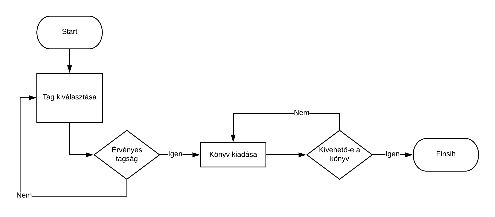
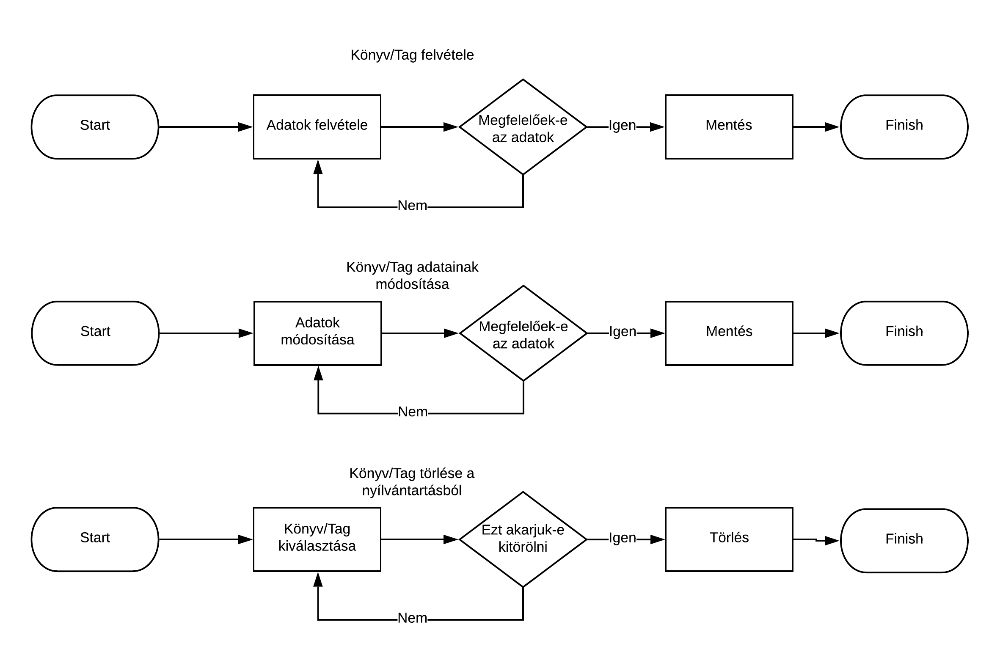

# TRYHARD  
## Rendszerterv  
  
  
A korábbiakban elkészült Követelmény specifkácó és Funkcionális specifikáció  
alapján az alábbiakban a szoftver Rendszertervét ismertetjük.  

### Bevezetés  

A rendszerterv elkészítésének célja az ,hogy a program fejlesztőinek pontos, részletes 
és szaknyelvet tartalmazó leírás legyen a kezében ami kitér a  rendszerrel kapcsolatos összes fontos szakmai kérdésre.
A szoftver egy kisvárosi könyvkölcsönző működését hivatott elősegíteni.
Célja az analóg rendszer digitálisra cserélése ennek következtében a könyvtár
fenetarthatóságát képes növelni és a dolgozok munkáját meggyorsítani . 
Adminisztratív és  könyv kölcsönzés és egyéb feladatok ellátása számítógépes 
környezetben. A cél platformunk a kölcsönző tulajdonában lévő számítógépek mely 
Linux alapú operációs rendszer futtatnak, név szerint az Ubuntut. A megvalósítás 
miatt a program alkalmas lehet más operációs rendszer alatti futtatásra is, de 
ez nem elsődleges célja afejlesztésnek. A gépek hardverje 8 GB DDR4 -es RAMból, egy Intel
Core i7-8750H 2.20GHz típusú processzorból és egy NVIDIA GeForce GTX 1060
típusú videokártyából állnak. A gépek számára biztosítva van a stabil 10Mb/s
sávszélességű internet elérés. Ez által a megfelelő infrastruktúra kiégetésével 
megvan teremtve a megfelelő hátér ,hogy a dolgozok lehető legjobb hatásfokkal 
képesek legyenek használni a szoftvert.  A rendszer felé pitése egy szerver-kliens 
alapokra épülő modell,egy közös H2 adatbázis motorral rendelkező adatbázison, 
amelytárolja az elérhető könyveket, illetve az ügyfelek alapvetően szükséges 
adatait amely az "egyszerű és  egyben nagyszerű " elv alapján lesz elkészítve 
,hogy a könyvtárban dolgozók rövid tanulmányozás után képesek legyek átlátni a 
szoftver és kényelmesen tudják használni azt.Ezért a tervezet szerint olyan 
programozási nyelvet használunk ami megkönnyítői ennek a szoftvernek a leghatékonyabb
le kódolását. Erről bővében a Fejlesztő eszközök menüpontban térünk ki. 
A digitalizálás hatására sokall átláthatóbb kezelhetőbb és biztonságosabb lesz 
az új rendszer a régihez képest.
   
  
### A rendszer célja  

A rendszer célja a könyvtár adminisztrációs munkájának megkönnyítése amit  
a programunk egy JavaFX felhasználói felülettel és SQL adatbázis rendszerrel  
szeretne elérni.  
    
### A projekt tervezete  

  
A szoftver egy kisvárosi könyvkölcsönző működését hivatott elősegíteni.  
Célja az analóg rendszer digitálisra cserélése. Adminisztratív és egyébb  
feladatok ellátása számítógépes környezetben. A cél platformunk a kölcsönző  
tulajdonában lévő számítógép melyen Linux alapú operációs rendszer fut,  
név szerint az Ubuntu. A megvalósítás miatt a program alkalmas lehet más  
operációs rendszer alatti futtatásra is, de ez nem elsődleges célja a  
fejlesztésnek. A gép hardverje 8 GB DDR4 -es RAMból, egy Intel  
Core i7-8750H 2.20GHz típusú processzorból és egy NVIDIA GeForce GTX 1060  
típusú videókártyából áll. A gép számára biztosítva van egy stabil 10Mb/s  
sávszélességű internet elérés. A gépet a kölcsönző dolgozói használhatják. 
A rendszer felépítése egy adatbázis-kliens alapokra épülő  
modell. Ez egy H2 adatbázis motorral rendelkező adatbázis, amely  
tárolja az elérhető könyveket, illetve az ügyfelek alapvetően szükséges  
adatait. Mivel a rendszerünket az első fázisban nem készítjük fel a külső  
támadások kivédésére, csak belső, tűzfallal elzárt privát hálózaton javasoljuk  
a használatát. Ezzel megelőzhetjük a személyes adatok kiszivárgását.  
Emiatt a felhasználási mód miatt jelenleg az ügyfelek számára csak közvetett  
regisztráció elérhető, így a GDPR tájékoztatót javasolt papir alapon egy  
példányban hitelesítve tárolni illetve egyet az ügyfélnek adni. Így  
megfelelő bizonyító erővel bír problémák felmerülésekor. A rendszer ezen  
megvalósításában alkalmas az megfelelő rekordok lekérdezésére, módosítására,  
törlésére.
  
### A rendszer felépítése  
  
Az adatbázis kapcsolathoz szükséges egy adatbázis connection osztály,  
amely létrehozza, fenntartja, és zárja az adatbáziskapcsolatot.  
A funkciókhoz szükség van servlet osztályokra, amelyek felelnek a megfelelő  
kérések felépítéséért. A felhasználóval való kommunikációt javafx-ben íródott  
interface valósítja meg, ezek praktikusan külső fájlokból, és forrásból  
módosított részekből állnak.
Az adatbázisnak két lényegi táblája a könyveket, és az ügyfeleket tartalmazza.
A kölcsönzés megvalósításához szükség van egy kapcsolótáblára is, amelynek
rekordjai egy-egy kölcsönzési folyamatot ábrázolnak, a kölcsönző azonosítójával, 
a kölcsönzött könyv azonosítójával, valamint a kölcsönzési dátummal, és a 
határidővel (visszahozási dátummal). A könyvek táblában eltároljuk a példány 
azonosítóját, könyvtári azonosítóját (ami nem unique), címét, szerzőjét, 
kiadóját, kiadás évét, illetve hogy épp elérhető-e. Az tag táblában az 
adott személy kereszt és vezetéknevét, születési dátumát, lakcímét, 
illetve az egyedi azonosítóját tároljuk. A törlés a foreign keyek miatt 
az adott rekord azonosítóján kívüli értékeinek NULL-ra állításával történik, 
mivel nem szeretnénk, hogy egy esetleges tag vagy könyv törlése után az ID-jük 
felszabaduljon, mert így valótlan kölcsönzési adatok is keletkezhetnének. 
 A javafx-ben megvalósított UI-ban ha megadjuk egy könyvnek az azonosításához 
szügséges információkat akkor a program visszaadja ,hogy könyv megtalálható-e
a könyvtár könyveit tároló adatbázisában, illetve jelenleg ki van-e kölcsönözve 
vagy kikölcsönözhető. Ha egy könyvet egy tag kikölcsönöz akkor lehetőség nyílik, 
a könyv elérhetőségének értékét megváltoztatni.
A program tartalmazni fog egy olyan mezőt is ahol ha megadjuk egy tag azonosításához
 szügséges információkat akkor az applikáció meg tudja mondani azt, hogy
 az illető tagja-e a könyvtárnak, továbbá meg lesz a lehetőség arra is ,hogy 
hozzáadjunk a könyvtári tagok listájához olyan embert is aki még nem tag. 
További funkció lesz például ,hogy a könyvtárosnak lehetősége nyílik a program 
segítségével ellenőrízni ,hogy a könyvet mikor kölcsönözték ki illetve 
a könyvtári tagnak meddig lesz esedékes visszahozni. Illetve megtekinthető 
lesz az is ,hogy ki által lett kikölcsönözve a könyv.

A program controller részének megvalósítását Java programozási nyelven terveztük el.
A projekthez továbbá felhasználtuk a Maven nevű projekt menedzsment eszköztárat is.
  
Könyv        | Kölcsönzés   |Tag  
------------| --------------|---------  
   ID Primary key|KolcsonzesID PRIMARY KEY, UNIQUE |unique INTEGER           
   LibID VARCHAR  |KonyvID FOREIGN KEY(KONYV.ID) INTEGER  |  Vezeteknev VARCHAR                         
   Szerzo VARCHAR |TagID FOREIGN KEY(TAG.ID) INTEGER  |   Keresztnev VARCHAR                     
   Cim  VARCHAR   | KolcsonzesDatum  DATE  |   Születési datum  DATE                     
   Kiado VARCHAR  |  |   Lakcim VARCHAR                    
   KiadasEve DATE |Hatarido DATE     |                     
   Elerheto BOOLEAN|VisszahozasDatum DATE        |   
  
  
###  Projektmunkások és felelősségeik  
  
A projektet készítő négy személy teljesen egyenjogú szerepkörökkel rendelkezik.
Mind négyük kiveszi a részét a munka minden egyes fázisából és részéből. Mindnyájan
egyenrangú fejlesztői a programnak.

Név |   Szerepkör
-----------|---------
Keserű Kristóf  | szoftverfejlesztő
Szabó Ákos  | szoftverfejlesztő
Tóth Norbert    | szoftverfejlesztő
Varga Mátyás    | szoftverfejlesztő

  
### Ütemterv  

A követelmény specifikációnak, funkcionális specifikációnak és a rendszertervnek  
legkésőbb 2019.09.26-ra kész kell lennie. Ezt követi majd a programsorok   
megírása, amelynek a program átadására, vagyis 2019.09.30 a határideje.  
  
### Mérföldkövek  
  
A program elkészítésének fő mérföldkövei:  
- A Trelloban való regisztráció illetve a használatának elkezdése  
- A git repository elkészítése  
- A tagok git-re való regisztrációja illetve a projekthez felvétele  
- A követelményspecifikáció elkészítése  
- A funckionális specifikáció elkészítése  
- A rendszerterv elkészítése  
- A program JavaFX UI-jának elkészítése  
- A program adatbázisának elkészítése  
- A program controllerének elkészítése  
- A program tesztelése  
- A program bemutatása a megrendelőnek  
  
###  Üzleti szereplők  
  
A programot az éppen munkaidőben jelenlévő könyvtáros fogja használni.  
A könyvtár összes alkalmazottjának, akik ebben a munkakörben dolgoznak  
megvan a végzettsége és a tudása ahoz ,hogy TRYHARD csapat által készített  
programot magabiztosan képes legyen használni.  
  
###  Üzleti folyamatok  
Két példa az üzleti folyamatokra:

**Tag felvétele a rendszerbe:**

1.  Egy könyvtárban még nem regisztrált ügyfél besétál a könyvtárba azzal a cállal
,hogy tag szeretne lenni.

2. Felkeresi az ügyfél a könyvtári program kezelésére felkészített alkalmazottat.

3. Az alkalmazott elkéri a regisztrálni kívánó szeménynek az adatait 
(Neve, Születési dátuma) és egy ID segítségével felviszi a rendszerbe.
(A tagfelvételre készült, _Tag felvétele_ menüpontot használja

-----------------------------------------------------------------------

**Tag törlése a rendszerből:**

1. Egy könyvtárban regisztrált tag besétál a könyvtárba azzal a szándékkal
,hogy meg szeretné szűneteni a tagságát.

2. Felkeresi az ügyfél a könyvtári program kezelésére felkészített alkalmazottat.

3. Az alkalmazott megkéri a tagot ,hogy azonosítsa magát majd az alkalmazott belép
 a program Tag törlése menüpontjába.
 
4. Itt kiválasztja a tagot a tagok listájából majd a töröl gombra kattintva
 eltávolítja őt az adatbázisból

 
###  Üzleti entitások  
  
Az üzletben résztvevő entitások:  
- A programot használó könyvtári alkalmazott  
- A könyvtárban regisztrált tagok  
- A könyvtárban még nem regisztrált, de majd regisztráló tagok  
  
  
### Követelmények  

A program célja a jelenlegi könyvtári adminisztráció felváltása.
A jelenlegi folyamat analóg papír-ceruza segítségével vezetett adminisztrálás
digitalizálása. Mindezt a könnyebb és gyorsabb kezelhetőség érdekében, hogy
a könyvtár dolgozói hamarabb kiszolgálhassák a könyvtár tagjait. Könnyen nyílván
tudják tartani a könyvek státuszát és fizikai állapotát, a tagok esetleges késedelmeit.
  
### Funkcionális követelmények  
  
- Könnyen és egyszerűen kezelhető rendszer.
- Jól átlátható adatbázis kezelés.
- Egyszerű adatbázis lekérdezések lebonyolítása.
- Könnyed adatfelvétel és módosítás.
  
###  Nem funkcionális követelmények  
  
- Esztétikus felhasználói felület.
- Látás károsultak számára is megfelelő színvilág és betűméretek használata.
  
### Funkcionális terv  

A progrem célja a könyvtári munka felgyorsítása. A könyvtárban dolgozó személyzet
munkájának megkönnyebbítése. A jelenlegi analóg adminisztrációs módszer teljes felcserélése
digitális formára. A korábbi módszer minden 'funkciójának' átültetése számítógépes környezetbe.
Ezek a 'funkciók' nem mások, mint:
 - Könyvtár könyvjeinek nyílvántartása.
 - A könyvtár tagjainak nyílvántartása.
 - A kölcsönzési tranzakciók feljegyzése.
 - Bizonyos esetekben tagság megvonása.
 - Amortizáció esetén könyvek kivonása a nyílvántartésból.
  
### Rendszerszereplők  

A jelenlegi rendszerben és a későbbiakben is megkülönböztetünk 2 önálló entitás csoportot.
A csoportok között nem kizárt az átfedés lehetősége. A csoportok különböző cselekvőképsséggel
rendelkeznek. A két csoport név szerint az adminisztrációt végző 'Könyvtárosok csoportja' és 
a könyveket kölcsönző felhasználók csoportja, melnyek 'Tagok csoportja' a pontos megnevezése.
A Tagok csoportja igénybe veszi a könyvtár szolgáltatásait, míg a Könyvtárosok csoportjának
tagjai ezt nyílvántartják és kiszolgálják a másik csoportot. Hierarchia tekintetében kimondható,
hogy a Könyvtárosok csoportja a Tagok csoportja fölött helyezkedik el. Több 'jogosultsággla'
rendelkeznek a személyek ebben a csoportban. Azon fölül, hogy ők az adminisztrátorok, az ő 
feladatuk a Tagok értesítése problémák esetén. Hivatalos munkatársai a könyvtár szervezetének
 így nekik kell lebonyolítani a kapcsolattartást is a Tagokkal. Feladatuk kiterjed a Tagok
 értesítésére elmaradás esetén.
  
### Rendszerhasználati esetek és lefutásaik  
  

### Menü-hierarchiák  
    FŐMENÜ:
     - Kölcsönzés
        - Tag kiválasztása
	 - Kikölcsönözni kívánt könyv vagy könyvek kiválasztása
     - Tag felétele
     - Könyv felvétele
     - Tag módosítása
     - Könyv módosítása
     - Tag törlése
     - Könyv törlése
     - Kilépés
  
### Képernyőtervek  
  
A képernyőknek vannak közös elemei, ezek a navigációs gombok, melyek aktiválják
az adott funkciót, illetve visszalépnek a menübe.

A jelen esetben a kölcsönzőben szükség van:

   - #### Főmenü
        
    - Kölcsönzés
    - Új tag
    - Új könyv
    - Tag módosítás
    - Könyv módosítás
    - Tag törlés
    - Könyv törlés
    - Kilépés
   
   - #### Kölcsönzési folyamat indítása
      
      Szükség van az adott könyv/ek és a kölcsönző tag rekordjaira is, ezért
      mindkettőre külön külön szűrni tudni kell.
      + A tag adataira szűrő mezők
      + A taghoz tartozó szűrt választható rekordok listája
      + A könyv szűrői
      + A könyvek közti találatok a szűrések alapján
      + Az épp hozzáadandó könyvek listája

   - #### Új könyv felvétele
   
        + A rekordok táblázatos formában
        + A rekord attribútumainak megfelelő számú szöveges mező,
        + navigációs gombok.
   
   - #### Új tag felvétele
   
        + A rekordok táblázatos formában
        + A rekord attribútumainak megfelelő számú szöveges mező,
        + navigációs gombok.
        
   -  #### Meglévő könyv módosítása
   
         + A rekordok táblázatos formában
         + A rekord attribútumainak megfelelő számú szöveges mező,
         + navigációs gombok.      
   
   -  #### Meglévő tag módosítása
   
         + A rekordok táblázatos formában
         + A rekord attribútumainak megfelelő számú szöveges mező,
         + navigációs gombok.  
            
   - #### Meglévő könyv törlése
        Külön képernyőn a véletlen törlések elkerülésére. A törléshez rá
        kell szűrni a rekordra vagy kiválasztani a táblázatból.
        + A képernyő egy táblázatos reprezentációából áll a rekordoknak,
        + a lekérdező szűrők szövegmezői
        + navigációs gombok.
   
   - #### Meglévő tag törlése
        Külön képernyőn a véletlen törlések elkerülésére. A törléshez rá
        kell szűrni a rekordra vagy kiválasztani a táblázatból.
        + A képernyő egy táblázatos reprezentációából áll a rekordoknak,
        + a lekérdező szűrők szövegmezői
        + navigációs gombok.
  
  
### Fizikai környezet  
  
#### Hardver és hálózati topológia  
A gép hardverje 8 GB DDR4 -es RAMból, egy Intel  
Core i7-8750H 2.20GHz típusú processzorból és egy NVIDIA GeForce GTX 1060  
típusú videókártyából áll. A számítógép számára szükség esetén internet elérés biztosított.
  
  
#### Fizikai alrendszerek  
  
A Fizikai környezet nem rendelkezik alrendszerekkel.
  
### Fejlesztő eszközök  

A projekt során használt fejlszetői eszközök:  
- Java
- Maven  
- SQL  

### Keretrendszer  
  
- Java FX   
  
### Architekturális terv  
A rendszert felépítő alrendszerek
(szoftver komponensek) lényegében a Java ,Sql ,Mavan használata Java FX keretén belüli
használata.Az alrendszerek meghatározása után a tulajdonságaikat kiaknázva vezérlési,
valamint kommunikációs kapcsolatokat lehet létrehozni ez által. Ennek a megfelelő
komponensek és összekötök ismeretében magas szintű tervezetet jön létre. A rendszer
szerepe az érdekelt szereplő kommunikációjának lehetővé tétele ,a korai fejlesztési
fázisok döntéseinek támogatása a követelmények tükrében és emelet igen fontos a Nagy lépték"
újrafelhasználhatóság elősegítése. Ehez persze szükség van különféle forrásokra mint Üzleti és technológiai döntések
eredménye ,meghatározó a környezet szerepe , fejlesztők céljai és stratégiája által
befolyásolt követelmények vezetnek különféle szoftver architektúrákhoz. 
Mint minden folyamat ez is egy ciklus körül forog mint az :
- architektúrát meghatározó fejlesztő szervezet szerkezetéből
- szereplők
- Követelmények
- Technológiai környezet
- A tervező tapasztalata
 
Architektúra elemek:
- Architektúrális minta
  - típus elemek és kapcsolatok, kényszerek
  - pl. kliens-szerver minta
-  Referencia modell
   - standard funkcionális felosztás és
    adatfolyam megoldások
   - pl. adatbázis kezelő rendszer
- Referencia architektúra
  -   referencia modell leképezése szoftver
      elemekre
   - pl. ISO OSI architektúra  
### Egy architekturális tervezési minta  
  
A projekt során a az MVC (model-view-controller) modellt fogjuk alkalmazni.  
  
### Az alkalmazás rétegei, fő komponensei, ezek kapcsolatai  

A készítendő szoftver két alkalmazási rétegből áll. Ezek a Felhasználói réteg és 
a Kontroller réteg. A Felhasználói réteg egy grafikus felhasználói felületet biztosít
a könyvtár dolgozói számára. Főbb komponensei a 'Főmenü' és a menüben szereplő alpontok
amelyek már elérést biztoosítanak az egyes funkciókhoz a Kontroller rétegben. Az alpontok
mind egy-egy új ablakra vezetnek, melyeken grafikus felületen használhatóak a funkciók. 
Az alpontok között kivételt képez a 'Kilépés' menüpont, amely bezárja az alkalmazást. A
Kontroller réteg főbb komponensei a vezérlő utasítások, melyek az adatbázisba történő
módosításért felelnek. A másik fő komponens az pedig maga az adatbázis. Minden egyes 
funkcióhoz tartozik egy Felhasználói réteg és egy Kontroller réteg. Ezek a porgramkódban
is önálló egymással közvetlen kapcsolatban álló állományok.
  
### Rendszer bővíthetősége  
  
A későbbiekben felmerülhető lehetőségeket figyelembe véve, a rendszert bővíthetjük majd
újabb felhasználókkal. Például a Tag képes lehet majd egy a könyvtárban kihelyezett számítógépen
lekérdezni a saját adatait, módosítani azokat vagy megnézni meddig lehet nálla a kölcsönzött
könyv. Továbbá lehetséges egy zárt hálózat létrehozása a könyvtár területén. Amely lehetővé 
teszi egyetlen egy központi adatbázis használatát. Így nem jelenthetne problémát a különböző
számítógépeken felvett vagy módosított adatok ütközése az egyes munkaállomásokaon. A távlati
tervek között szerepelhet akár az egész bővített rendszer áthelyezése internetes környezetbe
a könnyebb elérhetőség érdekében.
  
### Biztonsági funkciók  
  
A lokális adattárolásra és a számítógéphez való korlátozott hozzáférésre tekintettel
nem láttuk szükségességét biztonsági funkciók beépítésére a rendszrbe.
  
### Adatbázis terv  
A program adatbázisát 3 fő táblára osztottuk:
Könyv:
   -Könyvtári ID
   -Szerző
   -Cím
   -Kiadó
   -Kiadás éve
   -Elérhető

Kölcsönzés:
   -Kölcsönzés ID
   -Tag ID
   -Kölcsönzés dátum
   -Határidő
   -Visszahozási dátum

Tag:
   -Azonosító
   -Keresztnév
   -Vezetéknév
   -Születési dátum

#### Logikai adatmodell  

   Könyv           | Kölcsönzés                            |Tag  
   ----------------|---------------------------------------|---------  
   ID Primary key  |KolcsonzesID PRIMARY KEY, UNIQUE       |unique INTEGER           
   LibID VARCHAR   |KonyvID FOREIGN KEY(KONYV.ID) INTEGER  |Vezeteknev VARCHAR                         
   Szerzo VARCHAR  |TagID FOREIGN KEY(TAG.ID) INTEGER      |Keresztnev VARCHAR                     
   Cim  VARCHAR    | KolcsonzesDatum  DATE                 |Születési datum  DATE                     
   Kiado VARCHAR   |                                       |   Lakcim VARCHAR                    
   KiadasEve DATE  |Hatarido DATE                          |                     
   |               |VisszahozasDatum DATE                  |    
   
### Implementációs terv  

A tervezési folyamatban célszerű az általános logikai felépítést mindig valamilyen 
grafikus reprezentációval
modellezni, mert az emberi agy vizualizált objektumokkal könnyebben dolgozik.
Az UML (=Unified Modeling Language), modellező nyelv segítségével a specifikációt és 
a tervezést is grafikus
formában, diagramok segítségével tudjuk dokumentálni. A követelményspecifikációban a használati
esetdiagramokat (use case), az adatbázis tervezésnél az adatbázis diagramot, az OOP 
tervezésnél az
osztálydiagramot és objektumdiagramot valamint a szekvenciadiagramot, aktivitásdiagramot
használhatjuk.

  
### Perzisztencia-osztályok  
A perzisztencia megvalósításáért a Hibernate objektum-relációs leképezést
megvalósító programkönyvtár felel.
Perzisztencia osztályok:
   -DBUtils
   -HibernateUtils
  
### Üzleti logika osztályai  
Az üzleti logika a háromrétegű adatkezelő alkalmazások középső rétege, amely meghatározza 
az alkalmazás működésének logikáját.
A háromrétegű architektúra az alkalmazást három különálló rétegre osztja fel. E rétegek 
komponensei önállóan léteznek, és együttműködésük során egyidejűleg több különböző 
alkalmazásnak is a részei lehetnek.
Az adatbázislogika az adatok nyers tárolását végzi. Semmilyen információval nem rendelkezik 
az adatok feldolgozásával vagy megjelenítésével kapcsolatban.
Az ügyviteli (üzleti) logika az alkalmazás logikáját, működési szabályait határozza meg. 
Semmilyen információval nem rendelkezik az adatok tárolásával vagy megjelenítésével kapcsolatban.
A felhasználói interfész feladata az ügyviteli logika által küldött adatok formázása és
megjelenítése. Biztosítja a felhasználó hozzáférését az ügyviteli logika szolgáltatásaihoz. 
Sohasem kerül közvetlen kapcsolatba az adatbázissal, és nem végez semmilyen műveletet az 
adatokon.
  
### Tesztterv  
Kód|Leírás|  
----|---  
T01:| A program elindítása  
T02: |Az adatbázisból egy létező könyvre való rákeresés  
T03: |Az adatbázisból egy nem létező könyvre való rákeresés  
T04: |Egy könyv hozzáadása az adatbázishoz  
T05: |Egy könyv állapotának kikölcsönzöttről való átállítása elérhetőre  
T06: |Egy könyv állapotának elérhetőről való átállítása kikölcsönzöttre  
T07: |Egy tag felvétele a tagok adatbázisába  
T08: |Egy tag eltávolítása a tagok adatbázisából
T09: |Egy könyv kikölcsönzése
T10: |Több könyv kikölcsönzése